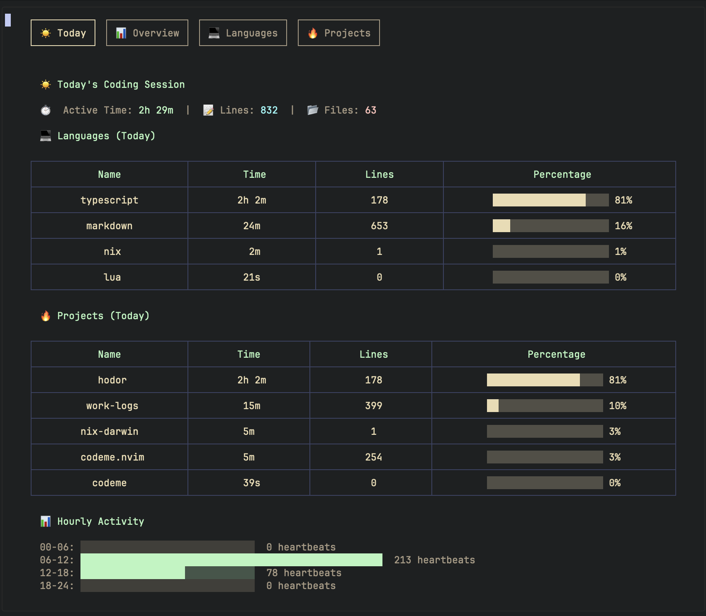
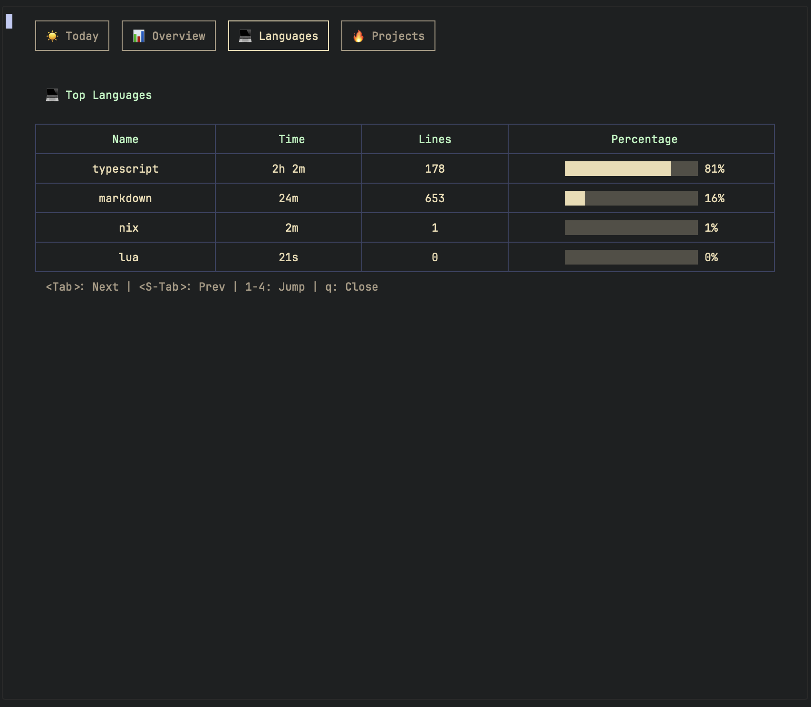
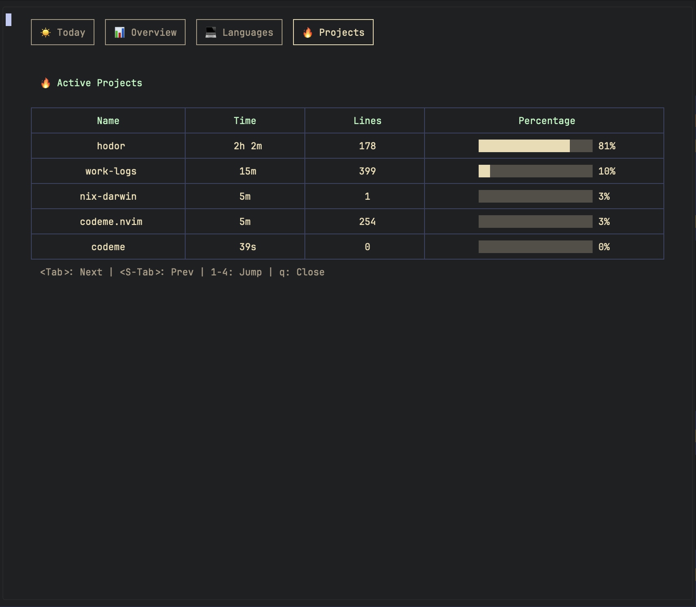

# codeme.nvim

> Beautiful coding activity dashboard for Neovim

## Features

- 100% private and local - all data stored in SQLite on your machine
- Tab-based dashboard with 4 interactive views
- Language breakdown with visual bar graphs and smart summaries
- Auto-tracking on file save
- Zero config - works out of the box
- Theme-aware - adapts to your colorscheme

## Privacy

Your coding data never leaves your machine:

- SQLite database stored locally at `~/.local/share/codeme/`
- No accounts, no cloud sync, no telemetry
- You own your data

## Installation

### Prerequisites

- Neovim >= 0.11
- [volt](https://github.com/nvzone/volt) - UI framework dependency
- [Codeme binary](https://github.com/tduyng/codeme) - auto-installed on first use

### Using lazy.nvim

```lua
{
  "tduyng/codeme.nvim",
  dependencies = { "nvzone/volt" },
  config = function()
    require("codeme").setup({
      -- Optional configuration
      auto_install = true,  -- Auto-install binary if not found (default: true)
      auto_track = true,    -- Auto track on save (default: true)
    })
  end,
  cmd = { "CodeMe", "CodeMeToggle", "CodeMeInstall" },
}
```

### Using native vim.pack (Neovim 0.12+)

```lua
vim.pack.add({
  "https://github.com/tduyng/codeme.nvim",
  "https://github.com/nvzone/volt",
})

require("codeme").setup()
```

### Binary Installation

The codeme binary will be **automatically installed** on first use. If you prefer manual installation:

```bash
# Download from GitHub releases
# Go to https://github.com/tduyng/codeme/releases
# Download for your platform (macOS arm64 or x86_64)

# Or use the Neovim command
:CodeMeInstall
```

## Usage

### Commands

| Command           | Description                              |
| ----------------- | ---------------------------------------- |
| `:CodeMe`         | Open the beautiful dashboard             |
| `:CodeMeToggle`   | Toggle dashboard visibility              |
| `:CodeMeToday`    | Show today's stats notification          |
| `:CodeMeProjects` | Show project breakdown                   |
| `:CodeMeInstall`  | Install/update codeme binary from GitHub |
| `:CodeMeVersion`  | Show installed codeme version            |

### Dashboard

**Navigation**

- `<Tab>` or `L` - Next tab
- `<S-Tab>` or `H` - Previous tab
- `1`, `2`, `3` - Jump to specific tab
- `q` or `<Esc>` - Close dashboard

#### Today



#### Overview


#### Languages



#### Projects



## Configuration

```lua
require("codeme").setup({
  -- Binary settings
  codeme_bin = "codeme",      -- Binary name (auto-detected if installed)
  auto_install = true,        -- Auto-install binary if not found

  -- Tracking settings
  auto_track = true,          -- Track files on save
  track_on_idle = false,      -- Track on cursor idle (not implemented)

  -- UI settings
  verbose = false,            -- Show tracking notifications
})
```

### Custom Keybinding

```lua
vim.keymap.set("n", "<leader>cm", "<cmd>CodeMe<cr>", { desc = "Open CodeMe Dashboard" })
vim.keymap.set("n", "<leader>ct", "<cmd>CodeMeToggle<cr>", { desc = "Toggle CodeMe" })
```

## License

MIT

---

Made with ❤️ for the Neovim community
